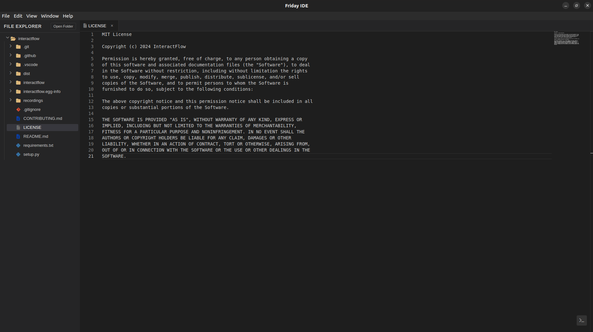

# Friday IDE

A modern, lightweight Integrated Development Environment (IDE) built with Electron and Monaco Editor. Friday IDE provides a powerful, intuitive coding experience with a sleek VS Code-inspired interface, making it perfect for developers who want a fast, customizable editor for their projects.



## Why Friday IDE?

- 🚀 Fast and lightweight
- 🎯 Familiar VS Code-like experience
- 💡 Smart code editing features
- 🔄 Seamless project management
- 🛠 Built with modern web technologies

## Features

- 🌟 Modern, intuitive user interface
- 📝 Monaco Editor integration for powerful code editing
- 🎨 Syntax highlighting for multiple programming languages
- 🌳 File explorer with tree view
- 💻 Integrated terminal
- 📦 Cross-platform support (Windows, macOS, Linux)
- 🎯 Tab-based file management
- 🎨 File icons based on file types
- 💾 Auto-save functionality

## Technology Stack

- **Electron**: Cross-platform desktop application framework
- **Monaco Editor**: VS Code's powerful editor component
- **Node.js**: JavaScript runtime
- **Xterm.js**: Terminal emulator
- **Font Awesome**: Icon library for file types and UI elements

## Project Structure

```
friday-ide/
├── fileTypeHelper.js    # File type detection and icons
├── terminal.js         # Terminal integration
├── preload.js         # Electron preload script
├── styles.css         # Application styling
├── index.html         # Main application window
└── package.json       # Project dependencies and scripts
```

## Key Components

### File Explorer
- Tree-based file navigation
- Custom file icons based on file types
- Folder expansion/collapse functionality
- File type detection system

### Editor
- Monaco Editor integration
- Multi-language syntax highlighting
- Tab-based file management
- File modification indicators
- Auto-save capability

### Terminal
- Integrated terminal using Xterm.js
- Customizable appearance
- Toggle functionality
- Command history

### Theme
- Dark theme optimized for coding
- Custom scrollbars
- Coherent color scheme
- Professional UI elements

## File Type Support

The IDE supports a wide range of file types, including but not limited to:

- **Web Development**: HTML, CSS, JavaScript, TypeScript, React, Vue
- **Programming**: Python, Java, C++, C#, Ruby, Go, Rust
- **Data & Config**: JSON, YAML, XML, TOML
- **Documentation**: Markdown, Text files
- **DevOps**: Dockerfile, Jenkins, Terraform
- **Package Files**: package.json, composer.json, requirements.txt
- **Version Control**: Git configuration files

## Development

### Prerequisites

- Node.js (>= 14.x)
- npm or yarn

### Installation

1. Clone the repository:
```bash
git clone https://github.com/yourusername/friday-ide.git
cd friday-ide
```

2. Install dependencies:
```bash
npm install
# or
yarn install
```

3. Start the application:
```bash
npm start
# or
yarn start
```

For development mode with auto-reload:
```bash
npm run dev
# or
yarn dev
```

## Contributing

1. Fork the repository
2. Create your feature branch (`git checkout -b feature/amazing-feature`)
3. Commit your changes (`git commit -m 'Add some amazing feature'`)
4. Push to the branch (`git push origin feature/amazing-feature`)
5. Open a Pull Request

## License

This project is licensed under the ISC License - see the LICENSE file for details.

## Acknowledgments

- [Monaco Editor](https://microsoft.github.io/monaco-editor/)
- [Electron](https://www.electronjs.org/)
- [Xterm.js](https://xtermjs.org/)
- [Font Awesome](https://fontawesome.com/)

---

Built with ❤️
