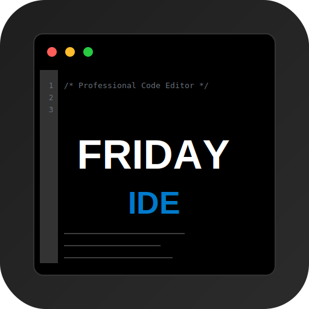
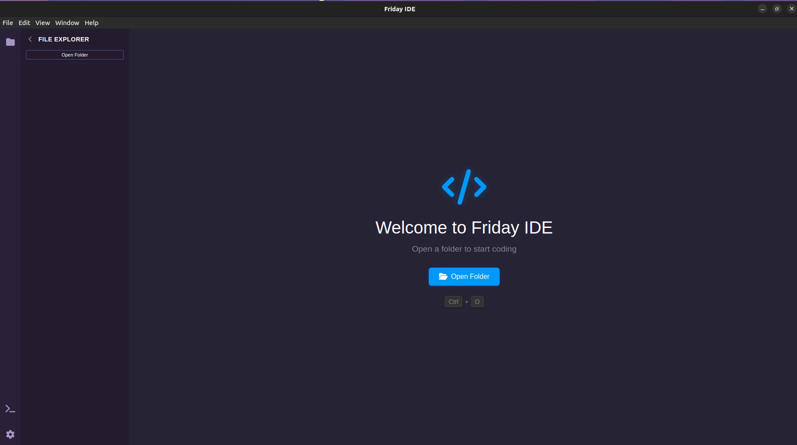
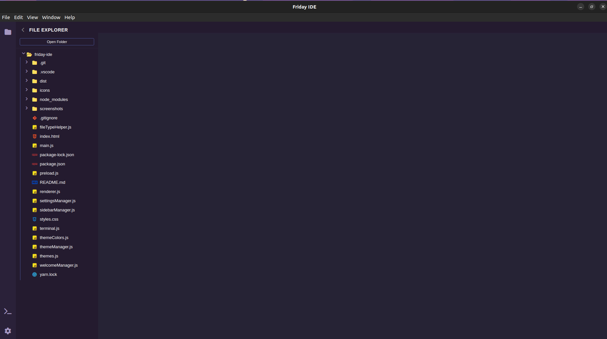
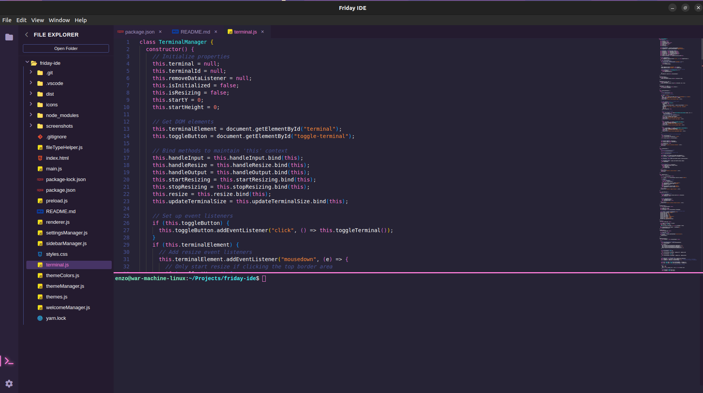
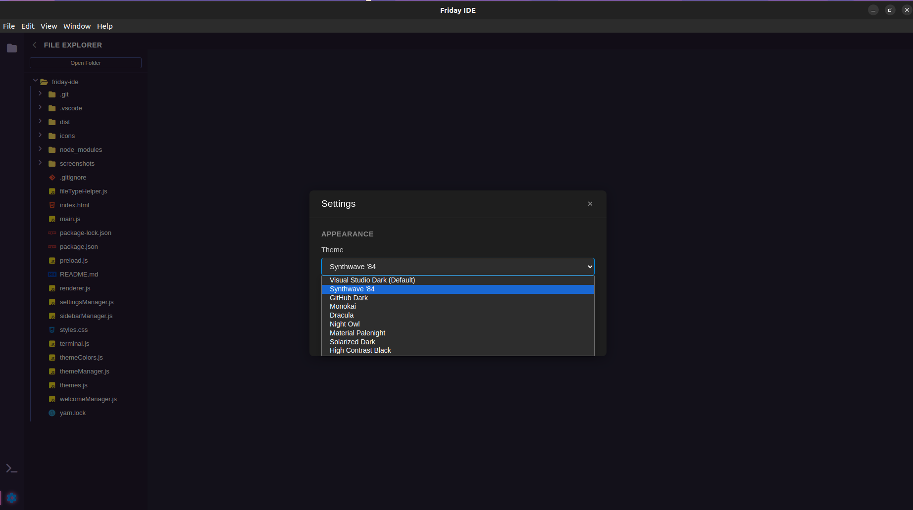

<div align="center" width="100%">
  
</div>

A modern, lightweight Integrated Development Environment (IDE) built with Electron and Monaco Editor. Friday IDE provides a powerful, intuitive coding experience with a sleek VS Code-inspired interface, making it perfect for developers who want a fast, customizable editor for their projects.

<div align="center">
  <table>
    <tr>
      <td></td>
      <td></td>
    </tr>
    <tr>
      <td></td>
      <td></td>
    </tr>
  </table>
</div>

## ✨ Key Features

### 🎨 Advanced Editor
- **Monaco Editor Integration**: Powered by VS Code's core editor component
- **Intelligent Syntax Highlighting**: Support for 40+ programming languages
- **Smart Code Editing**: Bracket matching, auto-indentation, and code folding
- **Multi-cursor Support**: Edit multiple lines simultaneously
- **Auto-save**: Never lose your work with automatic file saving

### 💻 Integrated Terminal
- **Full Terminal Emulation**: Built-in terminal with Xterm.js
- **Project Directory Awareness**: Automatically starts in your project folder
- **Clickable Links**: URLs in terminal are clickable and open in your default browser
- **Search Functionality**: Search through terminal output
- **Clipboard Support**: Easy copy/paste operations
- **Resizable Interface**: Drag to resize terminal height
- **Theme Synchronization**: Terminal automatically matches your IDE theme

### 🎯 Project Management
- **File Explorer**: Intuitive tree view for project navigation
- **Smart File Icons**: File type detection with custom icons
- **Tab Management**: Multiple file tabs with easy navigation
- **Project Context**: Maintains project directory context across sessions

### 🎨 Theming System
- **Multiple Themes**: Choose from various built-in themes
- **VS Code Compatibility**: Supports VS Code-like themes
- **Live Preview**: See theme changes in real-time
- **Consistent UI**: Unified theming across editor, terminal, and UI
- **Theme Persistence**: Remembers your theme preference

### ⚡ Performance
- **Lightweight**: Fast startup and minimal resource usage
- **Native Performance**: Built on Electron for native-like speed
- **Responsive UI**: No lag in editing or terminal operations
- **Efficient File Handling**: Smart file loading and saving

### 🛠 Development Tools
- **Integrated Development Tools**: Built-in developer console
- **Cross-Platform**: Works on Windows, macOS, and Linux
- **Extensible Architecture**: Modular design for easy extensions
- **Settings Management**: User-configurable settings with GUI interface

## 🚀 Getting Started

### Prerequisites
- Node.js (>= 14.x)
- npm or yarn

### Installation

1. **Clone the repository:**
```bash
git clone https://github.com/yashChouriya/friday-ide.git
cd friday-ide
```

2. **Install dependencies:**
```bash
npm install
# or
yarn install
```

3. **Start the application:**
```bash
npm start
# or
yarn start
```

### Development Mode
For development with auto-reload:
```bash
npm run dev
# or
yarn dev
```

## 🏗 Building

### Build for Linux:
```bash
npm run build:deb
```

### Build for all platforms:
```bash
npm run build
```

## 🔧 Technology Stack

- **Electron**: Cross-platform desktop application framework
- **Monaco Editor**: VS Code's powerful editor component
- **Node.js**: JavaScript runtime
- **Xterm.js**: Terminal emulator with addons for search, clipboard, and web links
- **Web Technologies**: HTML5, CSS3, Modern JavaScript

## 📁 File Type Support

The IDE supports a comprehensive range of file types:

- **Web Development**: HTML, CSS, JavaScript, TypeScript, React, Vue, Svelte
- **Programming**: Python, Java, C++, C#, Ruby, Go, Rust, PHP, Swift
- **Data & Config**: JSON, YAML, XML, TOML, INI
- **Documentation**: Markdown, Text, AsciiDoc, reStructuredText
- **DevOps**: Dockerfile, Docker Compose, Jenkins, Terraform, Kubernetes
- **Package Files**: package.json, composer.json, requirements.txt, Gemfile
- **Version Control**: .gitignore, .gitconfig, .gitmodules
- **Shell Scripts**: Bash, PowerShell, Batch

## 🔄 Project Structure

```
friday-ide/
├── fileTypeHelper.js    # File type detection and icons
├── terminal.js         # Advanced terminal integration
├── settingsManager.js  # Settings and preferences handling
├── themeManager.js     # Theme system and customization
├── preload.js         # Electron security bridge
├── styles.css         # Modern UI styling
├── index.html         # Main application window
└── package.json       # Project configuration and scripts
```

## 🤝 Contributing

I welcome contributions to Friday IDE! Here's how you can help:

1. Fork the repository
2. Create your feature branch (`git checkout -b feature/amazing-feature`)
3. Commit your changes (`git commit -m 'Add some amazing feature'`)
4. Push to the branch (`git push origin feature/amazing-feature`)
5. Open a Pull Request

## 📝 License

This project is licensed under the ISC License - see the LICENSE file for details.

## 🙏 Acknowledgments

- [Monaco Editor](https://microsoft.github.io/monaco-editor/)
- [Electron](https://www.electronjs.org/)
- [Xterm.js](https://xtermjs.org/)
- [Node.js](https://nodejs.org/)

---

Built with ❤️ Love and Time

[Report Issues](https://github.com/yashChouriya/friday-ide/issues) | [Request Features](https://github.com/yashChouriya/friday-ide/issues)
